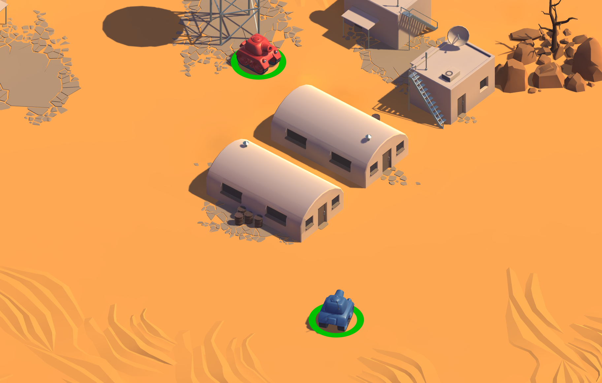

# Tanks Environment for ML-Agents (Unity 6 Updated)

A multi-agent reinforcement learning environment using the **Unity ML-Agents Toolkit**, where two agents compete in a strategic **1vs1 tank battle**.



This repository is a fully refactored version, updated to work seamlessly with Unity 6 and the latest ML-Agents package versions.

---

## Agent Design

### 1. Observation Space
The agent perceives the world through four distinct sensor types:

- Vector Observation:
    - Bool **canShoot**
- One-Hot Grid Sensor (can detect ('Enemy', 'Power Ups', 'Walls' and 'Obstacles'))
- Raycast Sensor
- Visual sensor

### 2. Reward Function
* **+1.0 (Win):** when you kill your opponent
* **-1.0 (Loss):** when you die

---

## How to Use

### Prerequisites
* **Unity 6** (or compatible newer versions).
* **Python 3.8+**
* **ML-Agents Python Package:**
    ```bash
    pip install mlagents
    ```

### Setup
1.  Clone this repository 
2.  Open the project 
3.  Navigate to the scenes folder and open the scene 'ML-Agents-Scene'

---

## Training the Agents

On terminal:
```bash
mlagents-learn Tanks.yaml --run-id=MyTanksRun

```

Of course, you don't have to use all these sensors at once: feel free to mix and match, and see which combination works better for you. Have fun!